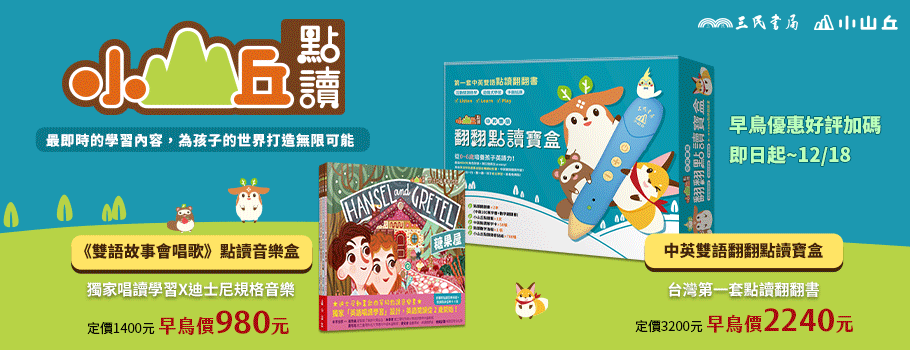

<!DOCTYPE html>
<html>
<head>
   <meta charset="UFT-8"> 
   <title>網站</title>
    </head>
 <body style="background-color:#E8FFF5;">

 

     
  <!--大海報-->

||<a href="#簡介">策展主題說明 </a>||
<a href="#創作團隊"> 團隊介紹</a>||<a target="_blank" href="書展.htm">特賣書點此連結</a>||
  <a href="https://www.sanmin.com.tw/#"
target="_blank">三民書局按此</a>||
<!--三民書局連結-->

    
     <h2 id="簡介">台北國際書展</h2>

我們不大，但我們的創意及能量足以傲視亞洲。
 
放眼亞洲的各個書展，比較北京、香港、首爾、東京或台北，以規模而言，台北不及北京；就參觀人數而論，香港超過台北；但是，由兼具閱讀推廣、國際交流、出版專業等功能，台北國際書展絕對堪稱是最具活力、最具多元特色和國際風味的國際書展。
 
從另一個角度來看，一年一度的台北國際書展正是台灣出版市場的縮影，反映了此刻華文出版市場的變化與挑戰。由於大陸出版市場的快速蓬勃發展，在國際 出版界中產生了自然而然的磁吸效應；台灣的出版市場總被與大陸相提並論和比較。就市場規模而言，台灣當然是「小」的，但，小反而具彈性，目標的設定和完成 能夠更為精準──台北國際書展的活力，正是此一事實的明證。
 
台北國際書展展現的活力，得自於台灣出版人的參與與經營，我們共同締造了此一亮麗成果。台北國際書展將透過更豐富的內容，彰顯台灣出版界 的魅力與實力：對外，具現台灣為華文出版樞紐的策略地位，以吸引期望開拓華文市場的全球出版人參與；對內，多層次的鋪陳台灣出版風貌，從文學／非文學、童 書、動漫等類型，到文字、圖像、聲音等形式，蒐羅紙本到數位等載體，持續打造最具文化視野的形象與口碑。
 
內容是形塑魅力和吸引力的關鍵。在此理念前提下，我們將與讀者、出版人共同展開新的閱讀生活的體驗，激發鼓舞全民閱讀熱情、提昇閱讀層次、開展新型態的閱讀嘉年華會。
 
我們將持續以數位出版為焦點，規畫數位出版主題館、數位出版專業論壇；我們將廣邀國際出版專業人士，舉行書籍設計、版權經紀工作坊和童書專業論壇，增進出版專業與交流。

 <a id=創作團隊>
  <a>策展團隊</a>
    
 <table border="1">
<!--表格-->
    
 <tr>
    <td style="background-color:#BBFFFF"target="_blank">
Dio

自我介紹: 
想不到吧，策展的不是別人，而是我Dio哒</td>
       <td></td>
 </tr>
<!--人物介紹其一-->

 <tr>
<td style="background-color:#BBFFFF">
夜神月

自我介紹: 
如此完美，其他人做得到嗎?</td>
 <td></td>
 </tr>
<!--人物介紹其二-->

<tr>
<td style="background-color:#BBFFFF">
江户川柯南

自我介紹: 
你來到此地只有一個真相，肯定是受到我的吸引了</td>
 <td></td>
</tr>
     <!--人物介紹其三-->
</table>

<h1>
   期中報告，三民書展</h1>

</body>
 </htm1>
